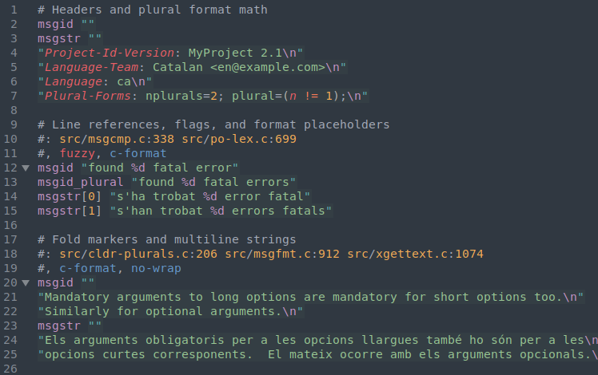

# sublime-gettext

[Sublime Text][st] support
for [`gettext`][gt]'s [Portable Object][po] (`.po`) translation files.

## Features

- Scopes for colors follow Sublime Text conventions
- Syntax highlighting for documentation key-values
    + Mini-language for `Plural-Formats`
- Goto Symbol for `msgid` contents
    + Even for multiline strings.
      See Known Issues below.
- Fold markers from `msgid` through the end of the block
- Flag-dependent placeholder formats for
    + Programming languages that use `printf` formatting
    + Programming languages with `{`/`}` brace placeholders
    + Shell's `$` dollar variables
    + Whatever you decide to add

## Installation

### Package Control

1. Make sure you already have [Package Control][pc] installed.
2. Choose **Install Package** from the Command Palette
    (<kbd>Super</kbd>+<kbd>Shift</kbd>+<kbd>P</kbd>).
3. Type **Gettext** and press <kbd>Enter</kbd>.

With [auto_upgrade][] enabled,
Package Control will keep all installed packages up-to-date!

### Using Git

1. Change to your Sublime Text `Packages` directory.
2. Clone this repository.

### Manual installation

1. Download the latest ZIP file (*./archive/master.zip*).
2. Unzip the archive to your Sublime Text `Packages` directory.

## Usage

### Build

Use <kbd>Ctrl</kbd>+<kbd>B</kbd> to invoke a simple `.mo` build system
for the currently opened `.po` file.
(<kbd>Cmd</kbd>+<kbd>B</kbd> on Mac)

### Source reference lookup

If your cursor is on a source reference in a `#:` comment,
<kbd>F12</kbd> will prefill it in the GoTo overlay.

### Snippets

#### Blocks

- `msg` => Simple Message
- `msgc` => Simple message in a context
- `msgcp` => Plural message in a context
- `msgp` => Plural message

#### Lines

- `ctx` => Message context
- `hdr` => Header
- `id` => Message ID
- `idp` => Message ID plural
- `str` => Message string
- `strp` => Message string plural

## Todo

- ~~Syntax regression tests~~
- ~~Investigate "range" flags~~
- ~~Custom fold markers~~
- ~~`printf` and other string formatting placeholders~~
  *Feel free to add more!*
- ~~Plurals mini-language in header~~
- Navigation by `fuzzy` or unfinished translations
- Toggle `fuzzy` flag
- ~~Go to source reference~~
- More build variants

## Known issues

- When the `msgid` contents are long,
  Goto Symbol may not find phrases in the middle.
- Placeholders in string content are shared
  between language families.
  The formats may not be perfect.
- The source reference lookup is a bit naive.

## Credits

- Snippets: [language-gettext](https://github.com/ArnaudRinquin/atom-language-gettext)

[st]: https://www.sublimetext.com
[gt]: https://www.gnu.org/software/gettext/
[po]: https://www.gnu.org/software/gettext/manual/html_node/PO-Files.html
[pc]: https://packagecontrol.io
[auto_upgrade]: http://wbond.net/sublime_packages/package_control/settings/
